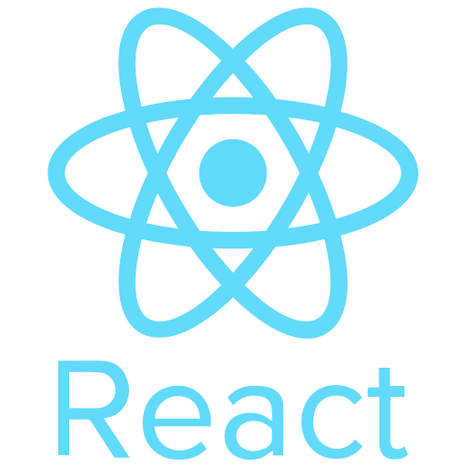

<!-- name -->
<h1 align="center">Hi 👋, I'm Avik Sarker</h1>

<h1 align="center">Lets, Read a Quote...</h1>

   
   

  
  

<!--
**Avik2293/Avik2293** is a ✨ _special_ ✨ repository because its `README.md` (this file) appears on your GitHub profile.

Here are some ideas to get you started:

- 🔭 I’m currently working on ...
- 🌱 I’m currently learning ...
- 👯 I’m looking to collaborate on ...
- 🤔 I’m looking for help with ...
- 💬 Ask me about ...
- 📫 How to reach me: ...
- 😄 Pronouns: ...
- ⚡ Fun fact: ...
-->

<!-- skills -->

## :computer: Technologies that I know
 

<!--  -->

 

## :chart_with_upwards_trend: Current Stats
 

  
   
  

<!-- about -->
<h1> <picture></picture> About Me</h1>

Software Engineer || Front-End Developer || React Developer || React Native Developer
 
I am Experienced with JavaScript, NextJS, NodeJS, ExpressJS, Mongoose/MongoDB, Laravel, MySql, ReactJS, React Native, Redux, and TypeScript.
 
 
I am a programmer and I am happy with this job. Because I like technology. The use of technology is increasing in the world. I want to make technology easy to reach people.
 
 
I am expert with React.js, React Native, JavaScript, Next Js, Express.js, MongoDB, Laravel, MySql, CSS, Bootstrap, React Bootstrap, Tailwind, DaisyUI, Chakra Ui, HTML, Firebase and I used many tools (Github, Netlify, Canva, Figma, React Icons, React Router, React Toast, React Query, React Photo View, React Hook Form, JWT, Context API etc).
 
 
I have earned a bachelor’s degree in Electrical and Electronics Engineering. I also did my web development course from Programming Hero. My course studies centred on web design, development, database management, coding, and the programming used to create websites.
 
 
I am working now in Shineygleam Softwere as a Junior Softwere Engineer. I have approximately 2 years of experience with this company. 
My job responsibility is creating the website front-end in React and integrating it with Laravel and MySql database. 
I also created some apps on React Native with the help of my senior in some projects for app development.
I am quick at learning new technologies and can follow instructions and work well with a team. 
 
 
Nowadays, I am working on building up my knowledge & skills in programming by doing course CPS Academy.
 
 
I am a freedom-loving person. I enjoy work. The only difference between me and those who upgrade the world is skill. I will work to improve myself. I dream of giving something new to the world one day.
 
 
📧 aviksarker22@gmail.com  
⌨️ 𝘛𝘦𝘹𝘵 / 𝘞𝘩𝘢𝘵𝘴𝘈𝘱𝘱: +880 1758727366  
📞 Call || Mobile: +880 1758727366  
<a href="https://www.linkedin.com/in/avik-sarker-95b012187/">Linkedin Profile</a> 
 
<a href="https://avik-sarker-portfolio.netlify.app/">Developer Portfolio</a> 
 
<a href="https://drive.google.com/file/d/1eDFZl-p3r4MZHYrEV_NyQMhQu0bkTjef/view?usp=sharing">Download Developer Resume</a>

 

 Last update: Nov 25, 2024

